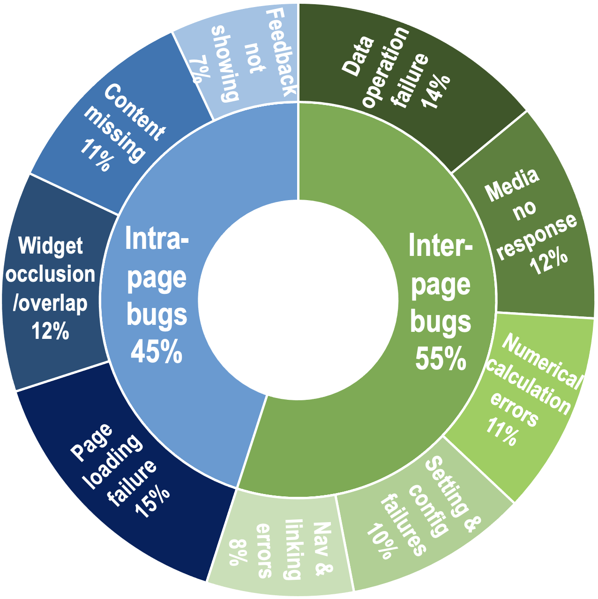

# Pilot Study

## Data
1. GitHub bug reports in `GitHub_Bug_Report_all.xlsx`
2. Our experimental dataset is collected from one of the largest open-source Android app hosting websites (GitHub), which has a great number of Android bug reports.
3. We employ the following criteria for app selection: more than 1K downloads in Google Play (popular), a public issue tracking system (traceable), and more than three years of development history (trustworthy).

## Bug categories
1. Intra-page non-crash functional bug denotes these bugs only related to a single GUI page, mainly involving the issues about information display as shown in Figure.
2. Inter-page non-crash functional bug denotes these bugs related to multiple GUI pages, i.e., involving a testing sequence to trigger it, with details in Figure.

