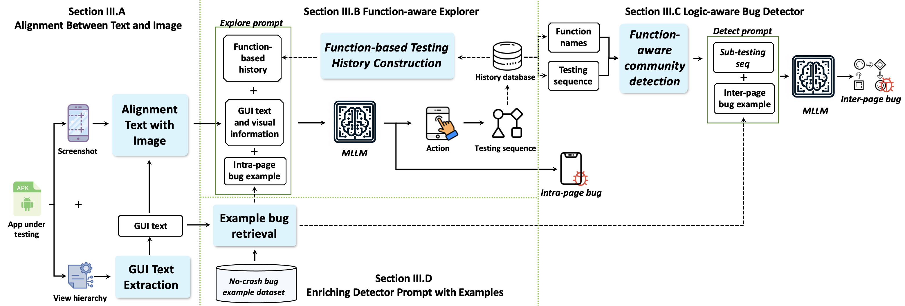

# VisionDroid 

VisionDroid, a vison-driven approach for detecting non-crash functional bugs with MLLM. It begins by extracting GUI text information and aligning it with GUI screenshots to form a vision prompt, enabling MLLM to understand GUI context. Second, the function-aware explorer utilizes the MLLM for GUI page exploration. It maintains a testing history comprising both the higher-level catalogue of testing progress and a detailed snapshot of each performed action, to enhance the exploration to be deeper and function-oriented. Third, the logic-aware bug detector breaks the entire exploration sequence into logically cohesive parts that mirror the app’s logical operational sequences. Based on them, the MLLM detects the bugs potentially by checking whether the GUI information changes between page transitions align with the processing logic. 

## structure



# VisionDroid Source code

## How to use
1. Generate Your API Key: Before we start working with the GPT-4 API, we need to login into OpenAI account and generate our API keys.
   `openai.api_key = "XXXXXXX"`
2. Installing the library: To work with the GPT-4 API, first, we have to install the openai library by running the following command.
3. Using “ChatCompletion” gpt-4-vision-preview, which is the same model used by GPT-4.
   
`from openai import OpenAI`

`client = OpenAI()`

`response = client.chat.completions.create(`

  `model="gpt-4-vision-preview",`

  `messages=[`

  `{`
  
      `"role": "user",`
      
      `"content": [`
      
        `{"type": "text", "text": "What’s in this image?"},`
        
        `{
         
         ` "type": "image_url",`

          `"image_url": {`

           ` "url": "https://upload.wikimedia.org/wikipedia/commons/thumb/d/dd/Gfp-wisconsin-madison-the-nature-boardwalk.jpg/2560px-Gfp-wisconsin-madison-the-nature-boardwalk.jpg",'

          `},`

        `},`

      `],`
    
    `}`

  `],`

  `max_tokens=300,`

`)`


### Requirements
* Android emulator
* Ubuntu or Windows
* Appium Desktop Client: [link](https://github.com/appium/appium-desktop/releases/tag/v1.22.3-4)
* Python 3.7
  * apkutils==0.10.2
  * Appium-Python-Client==1.3.0
  * Levenshtein==0.18.1
  * lxml==4.8.0
  * opencv-python==4.5.5.64
  * sentence-transformers==1.0.3
  * torch==1.6.0
  * torchvision==0.7.0

Use the gpt-4.


## This example introduces how to use ChatGPT

[a-simple-guide-to-gpt-4-api-with-python](https://platform.openai.com/docs/guides/vision)


## LLM Test

USE GPT-4 App Testing


### usage

Find app, change `cmd.py`  `PACKAGE = "xxx"` as package name

Package name in `adb shell dumpsys activity activities | grep mControlTarget=Window` 

Opensource app, find `AndroidManifest.xml` change `/main/app/src/main/AndroidManifest.xml` 


### Http

 `GptModel.py` 

```
import os
os.environ['HTTP_PROXY'] = 'http://127.0.0.1:10809'
os.environ['HTTPS_PROXY'] = 'http://127.0.0.1:10809'
```


### How to set up a proxy for OpenAI's API in Python?

https://github.com/Onelinerhub/onelinerhub/blob/main//python-openai/how-to-set-up-a-proxy-for-openai-s-api-in-python.md
